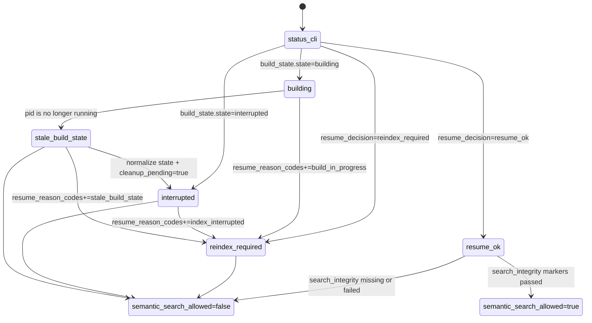

# Application State

This diagram maps the shared repository-health contract surfaced by
`status --json` and reused by the search entrypoints. It focuses on
`resume_decision`, normalized `build_state`, and whether semantic retrieval is
currently allowed.

| State | Transitions |
| --- | --- |
| `status_cli` | Evaluates cache metadata, profile drift, build state, and integrity markers. |
| `building` | Entered when persisted `build_state.state=building` still points at a live PID. |
| `stale_build_state` | Entered when a recorded `building` PID is dead and the payload is normalized before reuse decisions. |
| `interrupted` | Entered when persisted `build_state.state=interrupted` exists or `stale_build_state` is normalized into an interrupted cleanup case. |
| `resume_ok` | Reached when cache metadata and resume fingerprints are reusable. |
| `reindex_required` | Reached when metadata, build-state, profile, reset, or integrity checks say the cache is not reusable. |
| `semantic_search_allowed=true` | Reached only when `resume_ok` and both search-integrity markers pass. |
| `semantic_search_allowed=false` | Reached whenever reindex or integrity warnings make semantic retrieval unavailable. |

## Notes

- `stale_build_state` is not stored as-is; it is a normalized health-classifier
  result produced when a saved `building` PID is dead.
- `semantic_search_allowed=false` is broader than `reindex_required`; it also
  covers integrity failures on otherwise readable caches.
- See [../ERROR_CODES.md](../ERROR_CODES.md) for the error catalog that pairs
  with `resume_reason_codes` and search integrity warnings.
