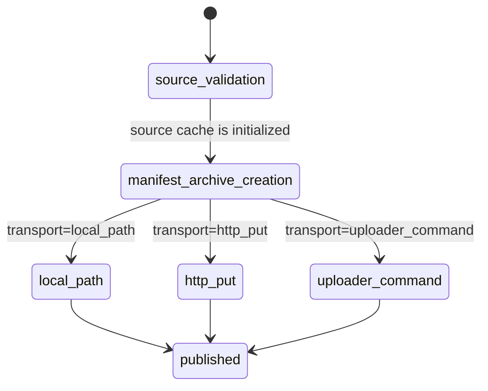

# Artifact Publish State

This diagram documents `gloggur artifact publish`, from source validation to
manifest/archive creation and the transport-specific publish path.

| State | Transitions |
| --- | --- |
| `source_validation` | Verifies the source cache path exists, is a directory, and contains `index.db`. |
| `manifest_archive_creation` | Builds manifest metadata and creates the deterministic tar.gz archive. |
| `local_path` | Copies the temporary archive to a filesystem destination. |
| `http_put` | Uploads the archive directly to an HTTP(S) destination. |
| `uploader_command` | Publishes through an external argv-style uploader template. |
| `published` | Final success payload with checksums, manifest metadata, and transport details. |

## Notes

- Destination validation happens before transport branching and can fail on
  unsupported schemes, destination collisions, or source/destination overlap.
- The final payload always reports `published=true`, plus the selected
  transport, archive checksums, and manifest data.
- Transport failures use artifact-specific error codes from
  [../ERROR_CODES.md](../ERROR_CODES.md).
