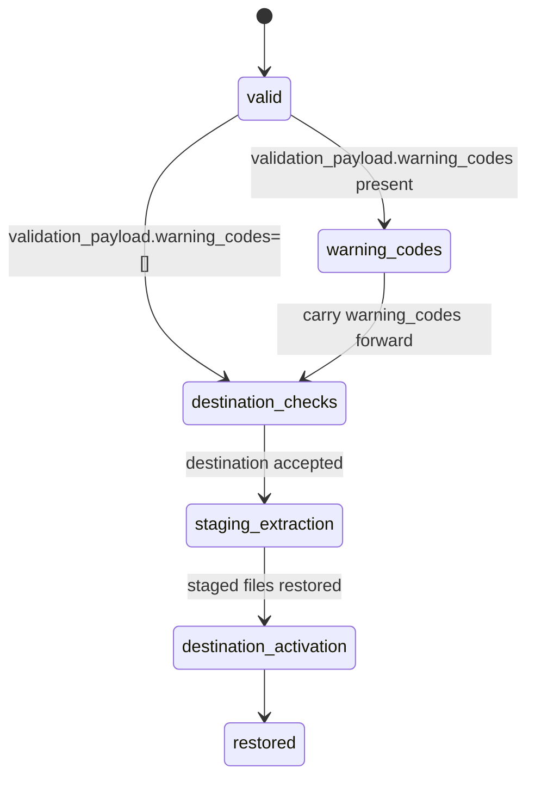

# Artifact Restore State

This diagram documents `gloggur artifact restore`, which always validates the
archive first and then restores through a staging directory before activation.

| State | Transitions |
| --- | --- |
| `valid` | Restore proceeds only after the embedded validation step reports `valid=true`. |
| `warning_codes` | Validation warnings are carried forward into the restore payload. |
| `destination_checks` | Verifies the destination path policy, overwrite behavior, and parent-directory readiness. |
| `staging_extraction` | Extracts cache members into a temporary restore directory. |
| `destination_activation` | Removes or replaces the final destination and promotes the staging directory into place. |
| `restored` | Final success payload with restored file counts and inherited validation warnings. |

## Notes

- Restore reuses the same validation logic as `artifact validate`, including
  provenance checks and expected manifest digest enforcement.
- `overwrite=false` blocks the transition out of `destination_checks` when the
  destination directory already exists.
- The final payload reports `restored=true` and includes any inherited
  `warning_codes`.
