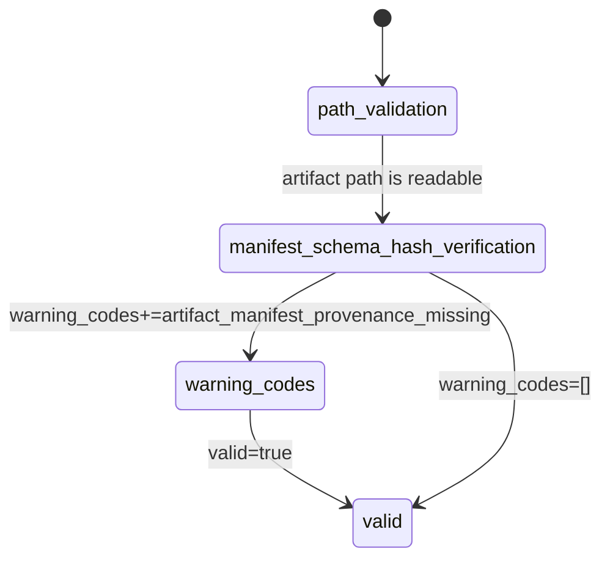

# Artifact Validate State

This diagram documents `gloggur artifact validate`, including the successful
`valid` path and the warning-only provenance branch.

| State | Transitions |
| --- | --- |
| `path_validation` | Verifies the requested artifact path exists and is a file. |
| `manifest_schema_hash_verification` | Reads the archive, validates `manifest.json`, schema version, totals, and optional file hashes. |
| `warning_codes` | Success-with-warnings path when provenance is missing but strict provenance was not required. |
| `valid` | Final success payload with archive metadata and hash-verification details. |

## Notes

- `require_provenance=true` changes missing provenance from a warning into a
  hard failure before `valid` is emitted.
- `expected_manifest_sha256` is enforced inside
  `manifest_schema_hash_verification`.
- The final payload may have `valid=true` and non-empty `warning_codes` at the
  same time.
