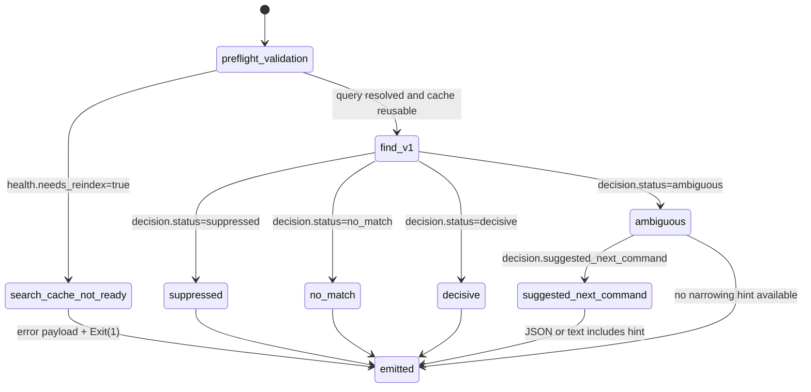

# Find Command State

This diagram documents `gloggur find`, which reuses the shared search-health
gate but emits the slimmer `find_v1` decision contract.

| State | Transitions |
| --- | --- |
| `preflight_validation` | Resolves query parts, validates `--about`, and checks option compatibility. |
| `search_cache_not_ready` | Shared cache-health error path reused from the search execution layer. |
| `find_v1` | Successful routed retrieval projected into the slim `find_v1` contract. |
| `suppressed` / `no_match` / `decisive` / `ambiguous` | Exact `decision.status` values emitted by the command. |
| `suggested_next_command` | Additive narrowing hint emitted for some `ambiguous` outcomes. |
| `emitted` | Final text, JSON, or NDJSON output step. |

## Notes

- `find` keeps the shared cache-ready gate but changes the success surface from
  `contextpack_v2` to `find_v1`.
- `stream` is an output-mode switch rather than a decision state, so it is
  treated as part of `emitted` here.
- `suggested_next_command` is optional and only appears on narrowing-friendly
  ambiguous paths.
