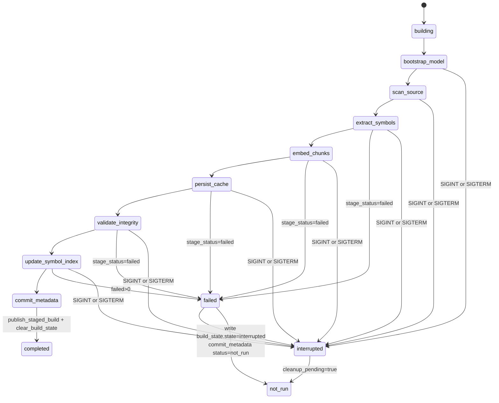

# Index Command State

This diagram captures the indexed build flow for `gloggur index`, including the
staged-build lifecycle, stage-level `completed` / `failed` / `not_run`
statuses, and interruption cleanup.

| State | Transitions |
| --- | --- |
| `building` | Build-state sidecar is written before staged work proceeds. |
| `bootstrap_model` through `commit_metadata` | Ordered stages recorded in the JSON `stages[]` payload. |
| `failed` | Stage-local outcome when categorized failure reasons are recorded. |
| `interrupted` | Build-state sidecar is rewritten on signal handling or pre-commit failure cleanup. |
| `not_run` | `commit_metadata` terminal status when the build cannot be published cleanly. |
| `completed` | Final successful publish path after staged data is promoted and build state is cleared. |

## Notes

- Repository and single-file indexing share the same top-level stage order even
  when some counters differ.
- `commit_metadata` is the publish boundary. Success there clears build state
  and persists last-success resume markers.
- `allow_partial` affects the command exit code, not the stage-state model.
