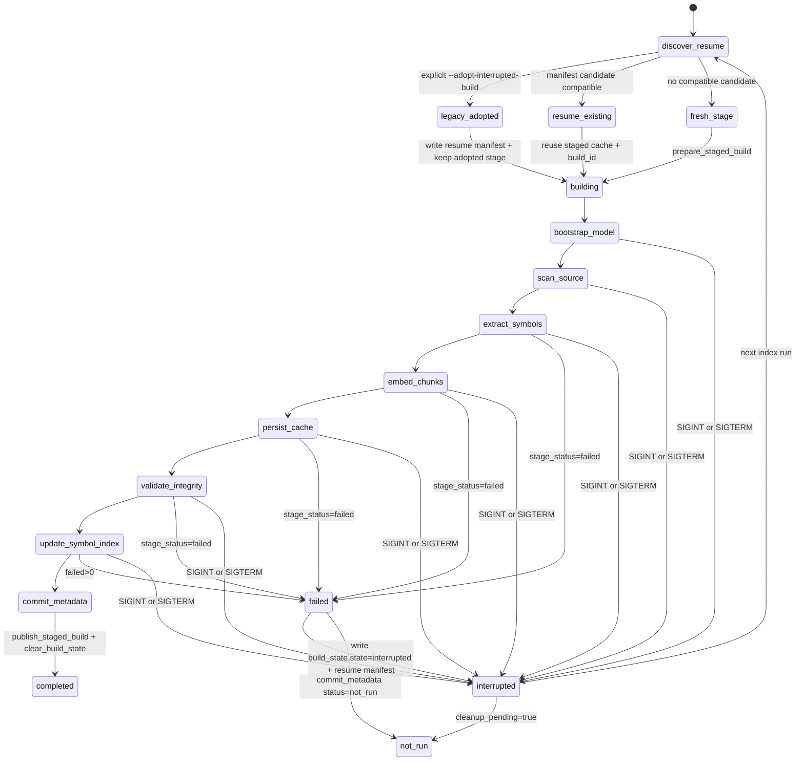

# Index Command State

This diagram captures the indexed build flow for `gloggur index`, including
startup resume discovery, staged-build reuse/adoption, stage-level
`completed` / `failed` / `not_run` statuses, and interruption cleanup.

| State | Transitions |
| --- | --- |
| `discover_resume` | Writer lock is held, then interrupted staged builds are inspected before cleanup. |
| `resume_existing` | Compatible manifest-backed staged build is reused in place with its existing build id. |
| `legacy_adopted` | `--adopt-interrupted-build` copies a legacy staged cache under `.builds/` and writes a resume manifest. |
| `fresh_stage` | No compatible interrupted build is available, so a new staged build is prepared from the canonical cache. |
| `building` | Build-state sidecar is written before staged work proceeds. |
| `bootstrap_model` through `commit_metadata` | Ordered stages recorded in the JSON `stages[]` payload. |
| `failed` | Stage-local outcome when categorized failure reasons are recorded. |
| `interrupted` | Build-state sidecar and staged `resume-manifest.json` are rewritten on signal handling or pre-commit failure cleanup. |
| `not_run` | `commit_metadata` terminal status when the build cannot be published cleanly. |
| `completed` | Final successful publish path after staged data is promoted and build state is cleared. |

## Notes

- Repository and single-file indexing share the same top-level stage order even
  when some counters differ.
- Successful embedding batches are written to the durable embedding ledger
  immediately during `embed_chunks`, so resumed/retried builds can reuse vectors
  even if the process dies before file-level staged-cache persistence.
- `commit_metadata` is the publish boundary. Success there clears build state
  and persists last-success resume markers.
- The embedding ledger lives outside staged-build promotion, so `clear-cache`
  preserves it unless `--purge-embedding-ledger` is requested.
- `allow_partial` affects the command exit code, not the stage-state model.
