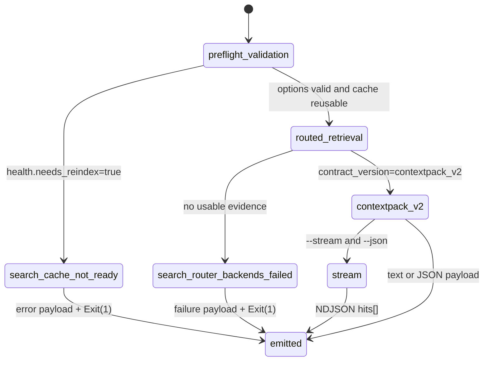

# Search Command State

This diagram documents `gloggur search` from option validation through the
shared cache-health gate, routed retrieval, and final payload emission.

| State | Transitions |
| --- | --- |
| `preflight_validation` | Validates CLI options before any cache or router work begins. |
| `search_cache_not_ready` | Error state emitted when shared health reports `needs_reindex=true`. |
| `routed_retrieval` | Router and backend execution path when the cache is reusable. |
| `search_router_backends_failed` | Error state when the router cannot produce usable evidence. |
| `contextpack_v2` | Successful full-fidelity payload path with `summary` and `hits[]`. |
| `stream` | NDJSON emission path when `--stream --json` is used. |
| `emitted` | Final output step for text, JSON, or NDJSON responses. |

## Notes

- Removed v1-only grounding flags fail during `preflight_validation`; they do
  not create a separate search lifecycle.
- `search_cache_not_ready` carries the shared resume/build-state metadata so the
  caller can diagnose why search was gated.
- `contextpack_v2` is the success contract regardless of search mode.
