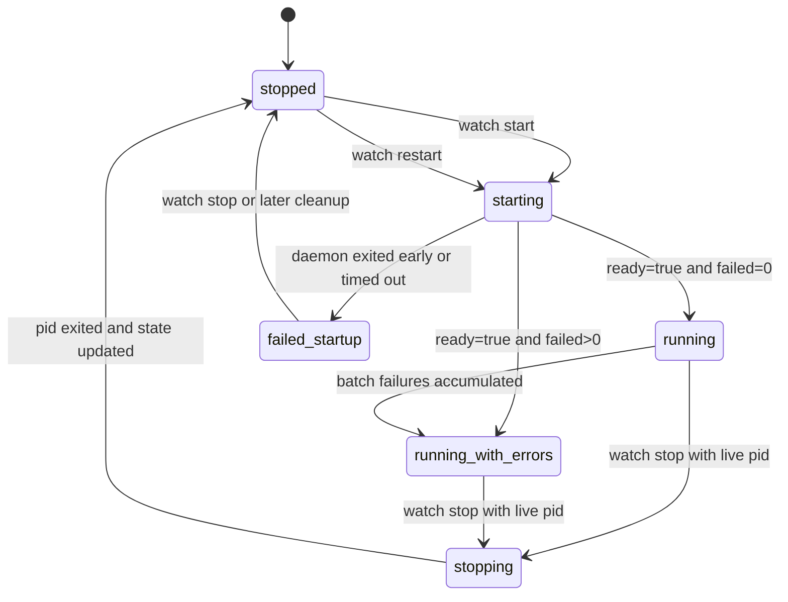

# Watch Command State

This diagram covers the shared runtime watch state manipulated by `watch init`,
`watch start`, `watch status`, and `watch stop`. It documents the normalized
status labels emitted from the state file and liveness checks.

| State | Transitions |
| --- | --- |
| `stopped` | No live watch process is running, or stop/status normalized the runtime to stopped. |
| `starting` | Watch state written after startup begins but before a ready backend is confirmed. |
| `running` | Live watch backend is ready and accumulated failure counters are zero. |
| `running_with_errors` | Live watch backend is ready but total failure counters or last-batch failure signals are present. |
| `failed_startup` | Daemon mode exited early or timed out before reporting a stable ready state. |
| `stopping` | `watch stop` signaled a live PID that has not exited yet. |

## Notes

- `already_running` is intentionally not a state. It is a guarded `watch start`
  response when the pid file already points at a live process.
- `watch status` can synthesize `running_with_errors` from drifted counters and
  `last_batch` data even when the raw state file is incomplete.
- `watch init` is configuration setup; it enables the watch path and defaults
  but does not create a long-lived runtime state by itself.
